# Transmission WebUI

A browser interface for a Transmission daemon. It is a static page: the browser talks to Transmission directly, the page keeps no server of its own, and the only password is the one Transmission already requires.

This document is the design. It is not an implementation. The pictures are mockups of the default teal theme, filled with sample torrents so the layout can be judged.

Target daemon: Transmission 4.0 or newer. The wire protocol is the bespoke RPC described in the [Transmission 4.0.6 RPC specification](https://github.com/transmission/transmission/blob/4.0.6/docs/rpc-spec.md): a JSON body with `method`, `arguments`, and `tag`, kebab-case method names, and the historical camelCase torrent fields. Transmission 4.1 also accepts a JSON-RPC 2.0 dialect with snake_case names. This interface speaks the bespoke dialect, which current Transmission 4 releases still accept, and which is the contract named below (`torrent-get`, `percentDone`, and the rest).

## 1. What it has to do

- Sign-in uses Transmission’s RPC username and password. The interface stores no password of its own.
- Every call is an HTTP POST to `/transmission/rpc`.
- A `409` response yields a new `X-Transmission-Session-Id`. The client stores that value and sends the same request again with the header set.
- While the library is open, the client polls `torrent-get` every 2 seconds for `id`, `name`, `status`, `percentDone`, `rateDownload`, `rateUpload`, `eta`, `totalSize`, `uploadRatio`, and `errorString`.
- The same screen manages the session: add, start, stop, verify, reannounce, queue, files, peers, trackers, labels, speed limits, and the rest of the session settings Transmission exposes.
- The chrome is hues of one colour, including the favicon. Settings lets the person pick that colour, and choose light, dark, or match the system.
- Torrent status, speeds, and session facts are whatever Transmission last reported. A setting changes on screen only after the daemon accepts it and a follow-up read returns the new value.
- The shell is laid out with CSS flex and grid.
- The page is installable as a PWA.
- The same information is usable with a mouse on a wide window and with a thumb on a phone.
- Interface copy uses British spelling. RPC field names stay as Transmission spells them.

## 2. Context

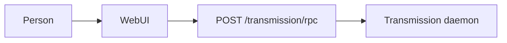

The page and the RPC endpoint share an origin. Script can read `X-Transmission-Session-Id` only on a same-origin response. A second origin would hide that header unless a proxy explicitly exposed it, so cross-origin use is out of scope.

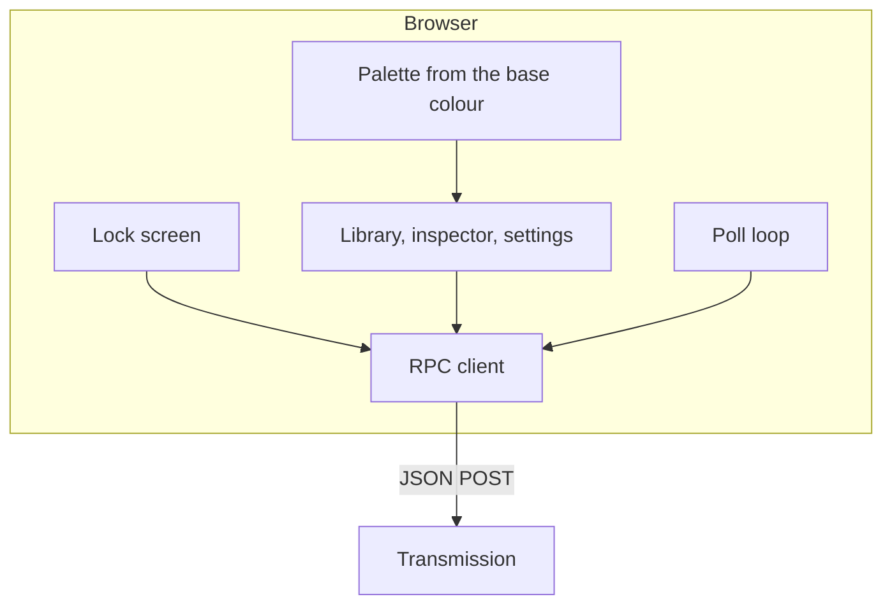

There is no application backend. Credentials, the session id, and the torrent list live in the page.

## 3. Hosting

Serve the static files and proxy the RPC on one host.

```nginx
server {
  listen 443 ssl;
  server_name transmission.example;

  root /var/www/transmission-webui;

  add_header Content-Security-Policy "default-src 'self'; connect-src 'self'; style-src 'self'; script-src 'self'; manifest-src 'self'; img-src 'self' data: blob:; worker-src 'self'; base-uri 'none'; form-action 'none'" always;

  location / {
    try_files $uri /index.html;
  }

  location /transmission/rpc {
    proxy_pass http://127.0.0.1:9091;
    proxy_set_header Host $host;
  }
}
```

The `Host` value that reaches Transmission must be allowed by `rpc-host-whitelist`. Localhost and IP addresses are always allowed. If the proxy forwards the public hostname, add that name to the whitelist.

The proxy forwards `Authorization` unchanged and does not add a password of its own. The page sends the password itself. Terminate TLS on any interface that is not only localhost, because the password travels as HTTP Basic.

Transmission can also serve the files from `TRANSMISSION_WEB_HOME`. In that mode the daemon applies `rpc-authentication-required` to the HTML as well as the RPC, so the browser shows its own sign-in dialogue before the page’s lock screen. Prefer the reverse proxy when a single password prompt matters. The RPC path in the client is always the absolute path `/transmission/rpc`, which is correct both at `/` and at `/transmission/web/`.

Build output is a static directory: one HTML file, CSS, and JavaScript. A bundler is optional. The palette is applied by a small script in the document head so the first paint already has the saved colour.

## 4. Signing in

Transmission checks the password. The page does not keep a second one, and it does not read `settings.json`.

The password Transmission expects is the plaintext configured as `rpc-password`, sent with the username from `rpc-username`. Transmission stores only a hash of that password. The page never sees the hash.

On load, before any torrent data is drawn, the client probes `session-get` with no `Authorization` header.

| Probe result | What the page does |
|---|---|
| `409`, then `401` after the session-id retry | Authentication is on. Show the lock screen. Keep the session id. |
| `401` immediately | Same as above. |
| `200` with `result: "success"` | Authentication is off. Show a blocking explanation: turn on RPC authentication in Transmission, then reload. Do not draw the library. |
| Network error or HTTP 5xx | Show “Transmission did not respond” and a way to try the probe again. |

The lock screen asks for the username and password. The username may be saved in `localStorage` under `twui.username`. The password is held in memory for the tab and is cleared on lock, on `401`, and when the tab closes. It is never written to `localStorage`, `sessionStorage`, the URL, or a log.

Submitting the form calls `session-get` with `Authorization: Basic …`. The value is the base64 of the UTF-8 bytes of `username:password`, not the result of `btoa` on a JavaScript string that may contain characters outside Latin-1.

| Unlock result | What the page does |
|---|---|
| `200` and `result: "success"` | Open the library and start polling. |
| `401` | Stay on the lock screen. Clear the password field. Say that Transmission did not accept the password. |
| `409` | Store the new session id and retry this call once. |

A later `401` on any call, including a poll, clears the in-memory list and returns to the lock screen. Lock, in the toolbar, does the same thing on purpose.

`session-get` on unlock also records `rpc-version`. The interface expects Transmission 4 (`rpc-version` 17 or newer) so labels, bandwidth groups, and `trackerList` exist. Older daemons still get a library from the polled fields. Controls whose methods the daemon rejects are hidden after the first rejection.

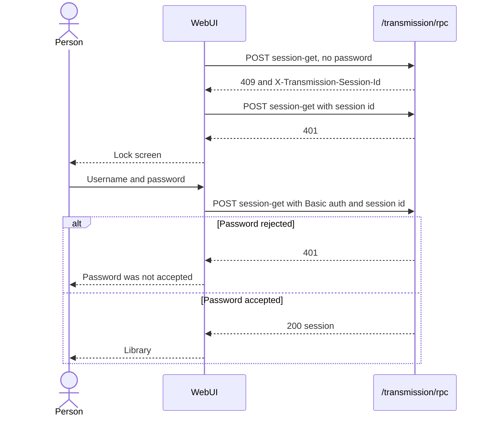


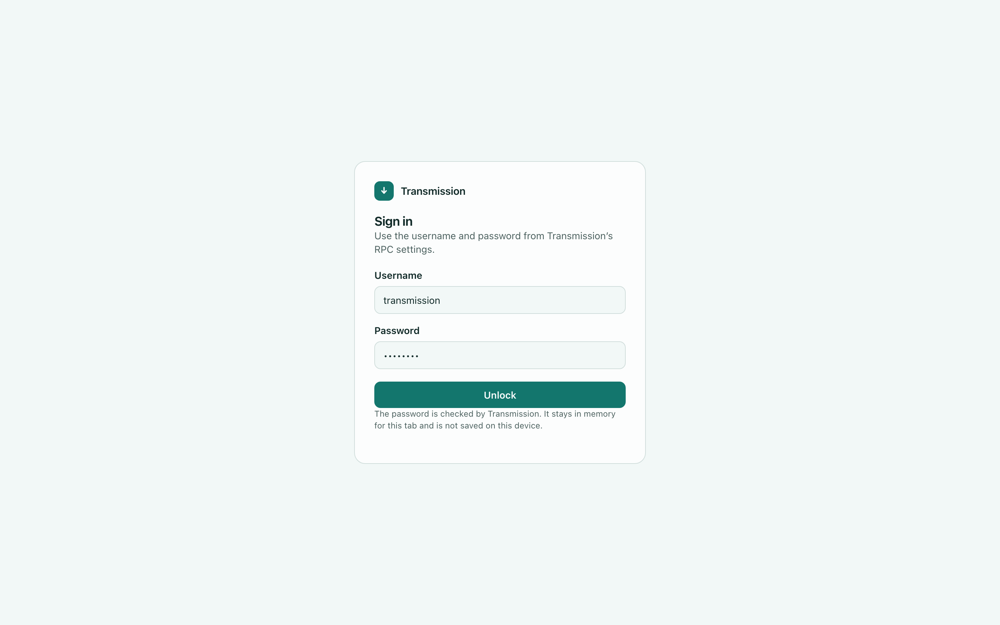

## 5. The RPC client

Every call is:

```http
POST /transmission/rpc HTTP/1.1
Content-Type: application/json
X-Transmission-Session-Id: <stored id, omitted on the first call>
Authorization: Basic <credentials, omitted on the unauthenticated probe>
```

```json
{
  "method": "torrent-get",
  "arguments": { "fields": ["id", "name"] },
  "tag": 12
}
```

A successful body has `result` equal to `"success"`, an `arguments` object, and the same `tag`. Any other `result` string is an error to show, with the daemon’s text.


Rules for the `409` path:

- Read `X-Transmission-Session-Id` from the response. If the header is missing, fail the call. Do not retry.
- Replace the stored session id with that value.
- Send the original method and arguments once more, with the header attached.
- A second `409` on that same call stops. Surface a connection error. Do not loop.
- Parallel calls that all receive `409` may each retry once. They share the latest stored id.

The client aborts a call that has not finished after 15 seconds so a stuck poll cannot pile up.

Integer torrent ids are not stable across a daemon restart. The interface uses them for the life of the page. After a restart the next poll replaces the list.

## 6. Polling

The library poll starts as soon as unlock succeeds, then every 2 seconds. A tick is skipped when a previous tick is still in flight, when the document is hidden, or when the page is locked. Becoming visible again runs a tick immediately and then resumes the 2 second cadence.

Each tick does two calls:

1. `torrent-get` with no `ids` (every torrent) and exactly these fields, in this order:

   `id`, `name`, `status`, `percentDone`, `rateDownload`, `rateUpload`, `eta`, `totalSize`, `uploadRatio`, `errorString`

2. `session-stats`, for the speeds and totals in the sidebar and on the activity page.

The field list on call 1 does not grow. Labels, queue position, files, peers, and trackers are other calls, made for the view that shows them.

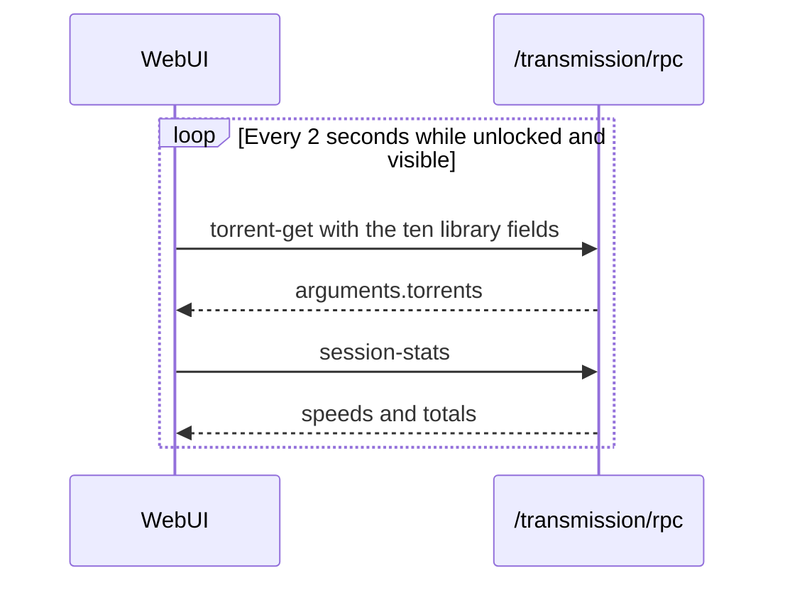

Example library request:

```json
{
  "method": "torrent-get",
  "arguments": {
    "fields": [
      "id",
      "name",
      "status",
      "percentDone",
      "rateDownload",
      "rateUpload",
      "eta",
      "totalSize",
      "uploadRatio",
      "errorString"
    ]
  },
  "tag": 41
}
```

`percentDone` is a fraction from 0 to 1. Rates are bytes per second. `totalSize` is bytes. `eta` is seconds, or `-1` when Transmission has no estimate. `errorString` is empty when there is no error.

`status` maps to a label:

| Value | Label | Library filter |
|---|---|---|
| 0 | Stopped | Stopped |
| 1 | Queued to verify | Checking |
| 2 | Verifying | Checking |
| 3 | Queued to download | Downloading |
| 4 | Downloading | Downloading |
| 5 | Queued to seed | Seeding |
| 6 | Seeding | Seeding |

Other library filters, still using only the polled fields:

| Filter | Rule |
|---|---|
| All | Every torrent |
| Active | `rateDownload > 0` or `rateUpload > 0` |
| Finished | `percentDone === 1` |
| Error | `errorString` is not empty |

A torrent can sit in both Downloading and Error. Counts are independent. Search is a case-insensitive substring of `name`, applied in the page, with no extra RPC. The default sort is by name. Column headers sort by any polled field. Sort and the current filter are remembered in `localStorage`.

A rate of 0 is shown as an em dash in the table. `eta` of `-1` is shown as “Unknown”. Stopped rows use an em dash for the estimate. Ratio is shown to two decimal places. Sizes and speeds use `units` from the unlock `session-get` (`speed-bytes`, `size-bytes`, and the unit-name arrays). Until that object arrives, divide by 1000 and use B / kB / MB / GB.

While the label list is on screen, a second `torrent-get` on the same 2 second tick asks only for `id` and `labels`. That call is not part of the library field list above.

While exactly one torrent is open in the inspector, another `torrent-get` on the same tick asks for that id and the detail fields in section 9. A multi-selection does not fetch peers or files.

A failed tick keeps the last list on screen and shows a reconnecting state. The next tick is still 2 seconds later. `401` leaves that path and locks.

## 7. The server is the record

Anything the page says about a torrent or the session comes from the latest successful RPC read. The page does not invent a status, a speed, a progress value, or an error, and it does not treat the button the person pressed as the new state.

A write (`torrent-start`, `torrent-stop`, `torrent-set`, `session-set`, and the other mutators) updates the screen only after both of these are true:

1. The write returns `result: "success"`.
2. A follow-up read of the affected fields returns, and the screen shows those returned values.

The follow-up read is `torrent-get` for torrent fields and `session-get` for session fields. Transmission may clamp or ignore a value, so the page displays what the read returns, which can differ from what was sent. Methods that return no arguments, such as `torrent-start`, still need that read: success means the command was accepted, and the next `torrent-get` is what changes the status label.

Until that read arrives, the previous server values stay on screen. The control that was used can be disabled and marked pending. It does not move to the requested value early. If the write returns an error string, times out, or never gets `success`, the pending mark clears and the last accepted values remain. The error text from `result` is shown on that action.

Text fields may hold a draft while they are focused, so the person can type. The draft is not the setting. Save, or leaving the field, sends the write. When the follow-up read returns, the field shows the server value. If the write fails, the field returns to the previous server value.

Toggles, selects, and checkboxes show the last read value the whole time. They move when the follow-up read says they moved.

These values are always a read, never a local guess: `status`, `percentDone`, rates, `eta`, `uploadRatio`, `errorString`, peer and file progress, `session-stats`, free space, `port-is-open`, and `blocklist-size`.

Appearance is the exception. Transmission has no field for the base colour, so that choice applies in the page as soon as it is picked, including the favicon. It is not reported as a daemon setting.

## 8. Library

Wide layout: filters and session speeds on the left, the torrent table on the right.

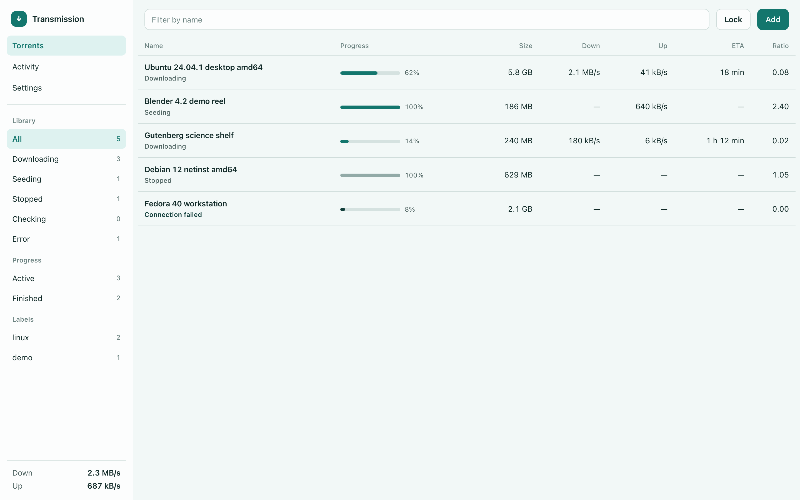

The same hue in dark mode. Stopped rows use a duller fill. Errors use a darker or lighter step of the same hue, plus the error text.

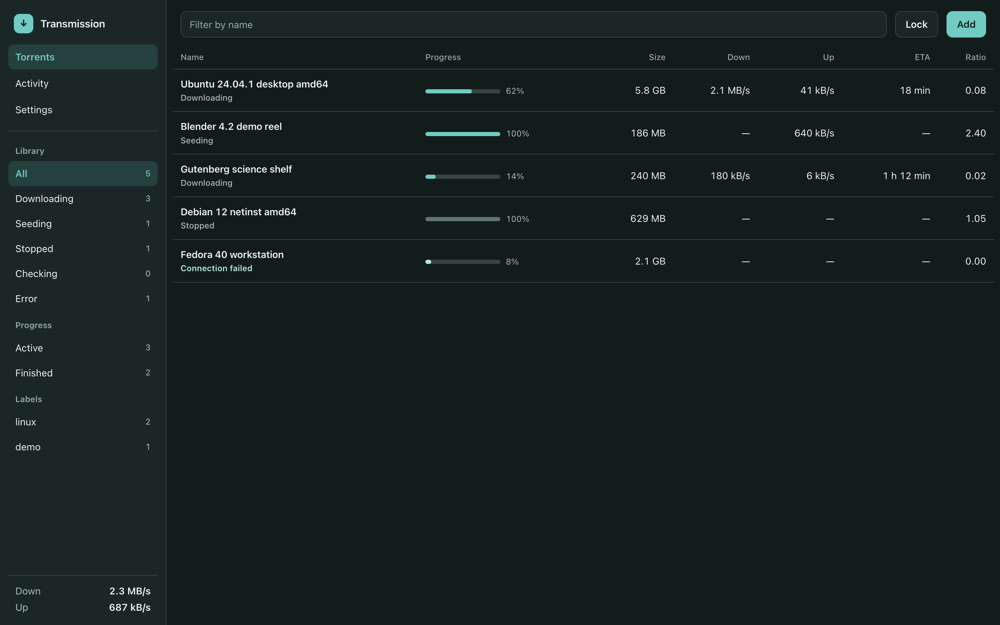

On a phone the table becomes cards, filters become a scrolling row of chips, and Torrents, Activity, and Settings sit on a bottom bar. Session speeds stay under the title.

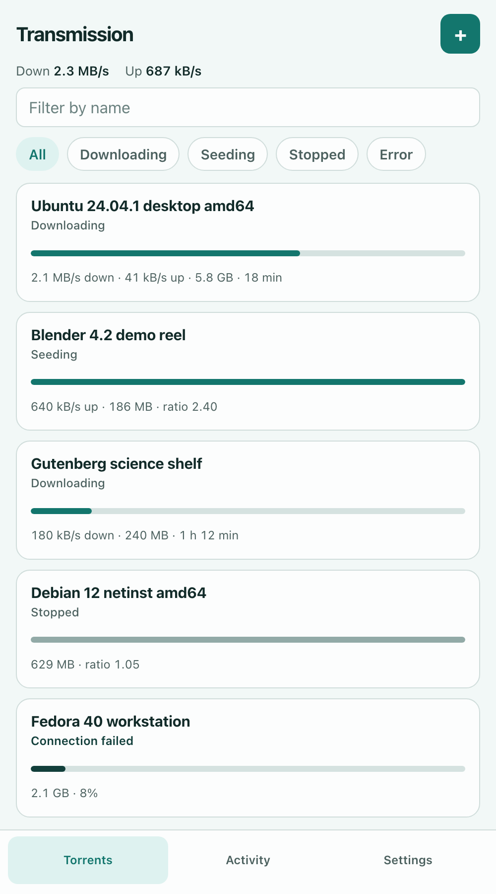

Row selection on a wide window: click, shift-click for a range, and command- or control-click to toggle. Escape clears the selection. On a phone, a tap opens that torrent. A Select action reveals checkboxes for bulk actions.

With a selection, the toolbar offers Start, Stop, Verify, and More. More contains Start now, Reannounce, Move up, Move down, Move to top, Move to bottom, Set location, and Remove. Choosing one sends the RPC call. The row’s status, rates, and queue position stay as the last `torrent-get` reported until a later read says otherwise.

| Action | Method | Arguments |
|---|---|---|
| Start | `torrent-start` | `ids` |
| Start now | `torrent-start-now` | `ids` |
| Stop | `torrent-stop` | `ids` |
| Verify | `torrent-verify` | `ids` |
| Reannounce | `torrent-reannounce` | `ids` |
| Queue | `queue-move-top`, `queue-move-up`, `queue-move-down`, `queue-move-bottom` | `ids` |

Remove asks first. The calm choice removes the torrent and leaves the files: `torrent-remove` with `delete-local-data: false`. The other choice deletes the downloaded files. That choice is a second confirmation that names the count, then `delete-local-data: true`.

Keyboard, when focus is not in a field: `/` focuses the filter, `a` opens Add, and Delete or Backspace starts the remove confirmation for the current selection.

Verifying rows say “Verifying” or “Queued to verify”. The library poll does not include `recheckProgress`, so the bar keeps showing `percentDone`. The open inspector requests `recheckProgress` and shows the check fraction there.

## 9. Inspector, add, and files

One selected torrent opens an inspector. On a wide window it is a third column. On a phone it replaces the list, with Back returning to the same scroll position.

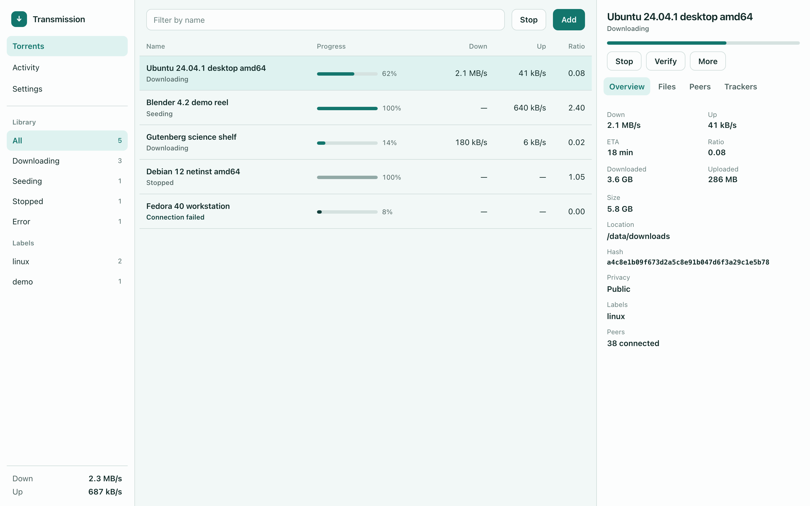

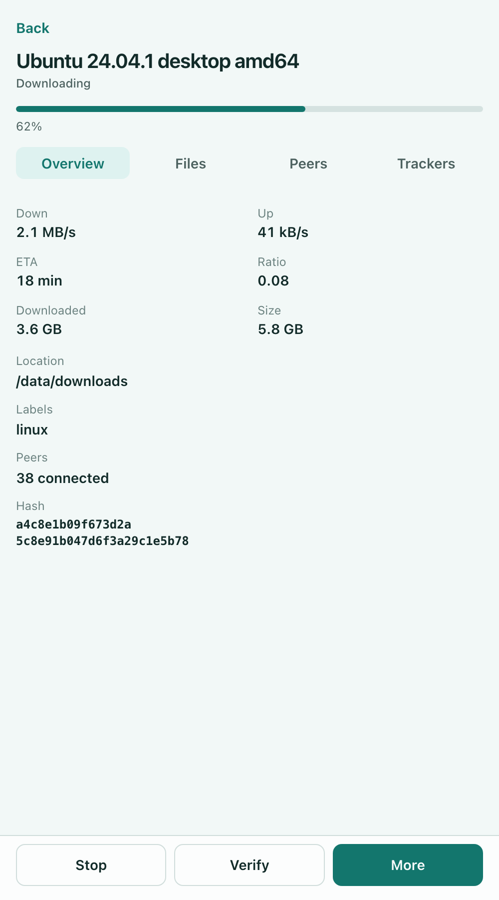

Tabs: Overview, Files, Peers, Trackers. They are loaded together for that one id:

`id`, `name`, `status`, `error`, `errorString`, `percentDone`, `recheckProgress`, `rateDownload`, `rateUpload`, `eta`, `uploadRatio`, `totalSize`, `sizeWhenDone`, `downloadedEver`, `uploadedEver`, `leftUntilDone`, `downloadDir`, `hashString`, `isPrivate`, `comment`, `labels`, `queuePosition`, `peersConnected`, `magnetLink`, `bandwidthPriority`, `honorsSessionLimits`, `downloadLimit`, `downloadLimited`, `uploadLimit`, `uploadLimited`, `seedRatioMode`, `seedRatioLimit`, `seedIdleMode`, `seedIdleLimit`, `peer-limit`, `group`, `files`, `fileStats`, `wanted`, `priorities`, `peers`, `peersFrom`, `trackers`, `trackerStats`, `trackerList`, `pieces`, `pieceCount`, `pieceSize`.

`error` is 0 when fine, 1 for a tracker warning, 2 for a tracker error, and 3 for a local error. The visible text is `errorString`.

Overview shows the speeds, estimate, ratio, sizes, location, hash, privacy, labels, and peer count. When `pieceCount` is 2000 or less, it also draws the `pieces` bitfield as a grid of cells in the accent hue. Larger piece maps are skipped so the page does not build thousands of nodes.

Per-torrent controls write through `torrent-set`:

- Bandwidth priority: low `-1`, normal `0`, high `1`.
- Honour session speed limits: `honorsSessionLimits`.
- Download and upload caps: `downloadLimited`, `downloadLimit`, `uploadLimited`, `uploadLimit`. Limits are in kB/s, as Transmission defines them.
- Seed ratio and idle time: mode `0` follows the session, `1` uses this torrent’s limit, `2` is unlimited.
- Labels, peer limit, bandwidth group, sequential download when the daemon returns that field.

Files lists `files` in order. A checkbox writes `files-wanted` or `files-unwanted` with the file’s index. Priority writes `priority-high`, `priority-normal`, or `priority-low`. An empty array means every file, so the client sends explicit indices.

Peers lists the `peers` array. An empty list says no peers are connected. `peersFrom` is a short breakdown: tracker, incoming, cache, DHT, PEX, LPD, and LTEP.

Trackers edits `trackerList`: one announce URL per line, and a blank line between tiers. Saving calls `torrent-set`. The deprecated `trackerAdd`, `trackerRemove`, and `trackerReplace` arguments are not used.

Rename, for a single torrent, calls `torrent-rename-path` with `ids`, `path`, and `name`, then refreshes `files` and `name`.

Set location calls `torrent-set-location` with `location` and `move: true` to move the files, or `move: false` to look for them in the new directory.

Several selected torrents show a short summary from the library fields (count, size, combined rates) and the bulk actions. They do not load peers or files.

### Adding

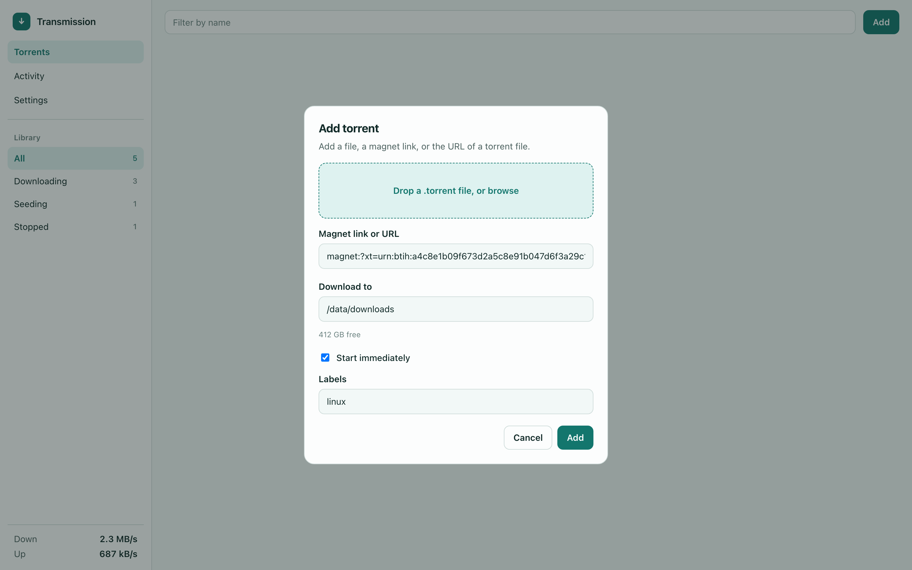

The dialogue accepts a `.torrent` file or a magnet link or HTTP URL.

- A file is read in the browser and sent as base64 in `metainfo`.
- A magnet or URL is sent as `filename`.
- `download-dir` defaults to the session’s `download-dir`. Changing it calls `free-space` and shows `size-bytes`.
- “Start immediately” maps to `paused`. The initial checkbox follows `start-added-torrents`.
- Labels are sent on `torrent-add` when the daemon is Transmission 4.

Either `filename` or `metainfo` is required. A duplicate comes back as `torrent-duplicate` with `result` still `"success"`. The page says the torrent is already present and selects it.

## 10. Activity and session settings

Activity reads `session-stats`: `downloadSpeed`, `uploadSpeed`, `activeTorrentCount`, `pausedTorrentCount`, `torrentCount`, plus `current-stats` and `cumulative-stats` (`downloadedBytes`, `uploadedBytes`, `filesAdded`, `secondsActive`, `sessionCount`). Those numbers are already refreshed by the 2 second tick. The wide layout also shows the current speeds at the bottom of the sidebar on every section.

Settings reads `session-get` when the section opens. It does not poll the whole session every 2 seconds. Each control shows the value from that read. Changing a control sends `session-set`, then `session-get` for the keys that were written, and the control updates from that second read, as in section 7.

| Section | What it edits |
|---|---|
| Appearance | Local only. Base colour and light, dark, or system. Not sent to Transmission. |
| Speed | `speed-limit-down`, `speed-limit-down-enabled`, `speed-limit-up`, `speed-limit-up-enabled`, `alt-speed-down`, `alt-speed-up`, `alt-speed-enabled`, `alt-speed-time-enabled`, `alt-speed-time-begin`, `alt-speed-time-end`, `alt-speed-time-day` |
| Downloads | `download-dir`, `incomplete-dir`, `incomplete-dir-enabled`, `start-added-torrents`, `rename-partial-files`, `trash-original-torrent-files` |
| Seeding | `seedRatioLimited`, `seedRatioLimit`, `idle-seeding-limit-enabled`, `idle-seeding-limit` |
| Connections | `peer-port`, `peer-port-random-on-start`, `port-forwarding-enabled`, `encryption`, `peer-limit-global`, `peer-limit-per-torrent`, `dht-enabled`, `pex-enabled`, `lpd-enabled`, `utp-enabled` |
| Queue | `download-queue-enabled`, `download-queue-size`, `seed-queue-enabled`, `seed-queue-size`, `queue-stalled-enabled`, `queue-stalled-minutes` |
| Blocklist | `blocklist-enabled`, `blocklist-url`, and `blocklist-update` which returns `blocklist-size` |
| Groups | `group-get` and `group-set` when those methods succeed |

`encryption` is `required`, `preferred`, or `tolerated` on the bespoke API. The control is labelled Allowed when the stored value is `tolerated`. Port check calls `port-test` and reports `port-is-open`. Download directories show free space from `free-space`, not the deprecated `download-dir-free-space`.

Script paths (`script-torrent-done-filename` and the added and seeding-done pair) live at the bottom of Downloads, as path fields, because they are session settings.

Shut down calls `session-close` from the bottom of Settings, after a confirmation that names the daemon.

The page does not offer a way to change the RPC password. That value is not a `session-set` field.

Wire keys are the bespoke spellings. They mix kebab-case and camelCase (`speed-limit-down` next to `seedRatioLimit`). Copy them as written. Do not translate them into the snake_case names from the 4.1 JSON-RPC document.

## 11. Layout

Structure is CSS flex and grid. Floats are not used. `position` is not used to place columns, toolbars, or cards. The modal scrim is the exception: it is `position: fixed` and covers the viewport, and its contents are centred with grid (`place-items: center`).

| Width | Structure |
|---|---|
| 1100px and up | A grid of sidebar, list, and inspector. The inspector column is there when one torrent is selected: `240px minmax(0, 1fr) 380px`. Otherwise `240px minmax(0, 1fr)`. |
| 720px to 1099px | One column in a vertical flex. Filter chips are a horizontal flex row. The inspector is a drawer that fills the viewport, itself a vertical flex. |
| Under 720px | One column flex. Bottom bar: a grid of three equal tracks, Torrents, Activity, and Settings. The inspector replaces the list. |

Regions:

- The sidebar is a column flex: brand, section links, a scrolling filter group (`minmax(0, 1fr)`), then speeds.
- The toolbar is a row flex. The filter field grows (`flex: 1`). Actions sit at the end and do not shrink below their text.
- Each library row on a wide window is a grid with the same column template as the header: name, progress, size, down, up, ETA, ratio. Name takes the remaining space (`minmax(0, 1fr)`). Numeric columns are `max-content`.
- Phone cards are a grid of rows inside a column flex. The bottom bar does not scroll away with the cards.
- The inspector is a column flex: title, actions, tab list, then a scrolling body. Overview stats are a two-column grid. Tabs are a grid of equal tracks.
- Settings is the same shell grid. Each settings form is a column flex of labelled controls. A row of related controls is a wrapping flex.
- Dialogue actions are a row flex, aligned to the end.
- Every grid and flex child that holds text sets `min-width: 0` so a long name or hash wraps inside the track instead of widening the page.

Touch targets that are tapped are at least 44px on the short side. Rows on a wide window can be shorter. Hover-only actions are also available from a visible button or menu. Inputs use a 16px font so a phone browser does not zoom the page when they are focused. The bottom bar respects the safe area.

The reconnecting banner sits above the list and does not cover the last row. Empty library: “No torrents yet” and the Add action. Empty filter: “Nothing in this filter” and a way back to All.

## 12. Colour

The interface is painted from one colour. The person picks that colour in Settings. Backgrounds, text, borders, the accent, the progress bar, emphasis, and the favicon all use its hue. Lightness and chroma change. The hue does not.

Preset swatches are samples of other base colours. They are the only place a second hue appears, and only as a choice. Choosing one repaints the whole interface, including Settings.

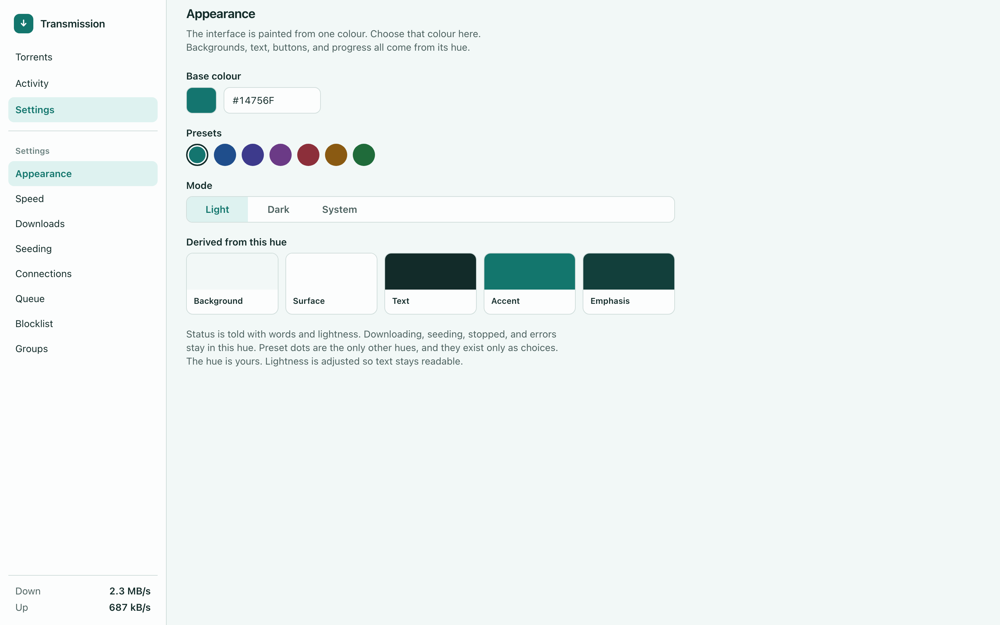

Default base colour: `#14756F`.

Stored in `localStorage`:

- `twui.baseColor` — the picked sRGB colour, default `#14756F`
- `twui.appearance` — `light`, `dark`, or `system`

`system` follows `prefers-color-scheme`. The head script reads both keys and sets the CSS variables before the first paint.

How a pick becomes a palette:

1. Convert the pick to OKLCH. Keep its hue `H`.
2. If chroma is below `0.02`, the pick is grey. Keep the previous colour. A grey has no hue to build from.
3. Build the light or dark set below from `H` and a small chroma taken from the pick. Do not use the pick’s lightness as a background. A near-white or near-black pick would otherwise wipe the page out.
4. The accent starts from the pick. Move its lightness, never its hue, until the accent and its label contrast at 4.5:1 or better, and until body text on the background does the same. Reduce chroma only when the colour would fall outside sRGB.
5. Emphasis, used for errors and destructive confirmation, is a further step of lightness on the same hue. Pair it with the error string or an icon. Status is never a second hue.

Light surfaces, hue `H`:

| Token | Use | OKLCH lightness | Chroma |
|---|---|---|---|
| Background | Page | 0.97 | at most 0.02 |
| Surface | Sidebar, cards, dialogues | 0.995 | at most 0.012 |
| Sunken | Tracks, input fills | 0.94 | at most 0.025 |
| Text | Primary text | 0.27 | at most 0.04 |
| Muted | Secondary text | 0.45 | at most 0.03 |
| Border | Hairlines | 0.86 | at most 0.02 |
| Accent | Buttons, links, active progress, selection wash | adjusted from the pick | at most 0.12 |
| Emphasis | Error text and error progress | darker than the accent | same hue |

Dark surfaces invert the lightness and keep `H`: background near 0.21, surface near 0.26, text near 0.96, accent lightness raised so it reads on the dark surface, emphasis lighter than the accent.

Progress fill:

| Row | Fill |
|---|---|
| Downloading, queued to download, seeding, queued to seed | Accent |
| Verifying, queued to verify | Accent, with the status words carrying the meaning |
| Stopped | Muted step of the same hue |
| `errorString` not empty | Emphasis |

Selection is a soft wash of the accent, with the accent used for the current nav item.

The settings sentence next to the control: “The hue is yours. Lightness is adjusted so text stays readable.”

`prefers-reduced-motion` disables decorative motion. Verifying does not depend on an animated stripe.

### Favicon

The favicon is the same mark as the sidebar: a rounded square in the accent, and a downward arrow in the on-accent colour. It is an SVG document the page builds from the current palette and assigns to `<link rel="icon" type="image/svg+xml">`.

The head script does this before the first paint, from `twui.baseColor` and `twui.appearance`, so a reload does not flash the default teal when another colour is saved. Changing the base colour, or switching light and dark, rebuilds the SVG and replaces the link. `<meta name="theme-color">` is set to the same accent at the same time, which colours the browser chrome and the installed app’s title bar.

`prefers-color-scheme` is the CSS media feature used when appearance is `system`. The name is the platform spelling and stays as written.

## 13. Installable app

The page meets the install criteria for a standalone web app: HTTPS (or localhost), a web app manifest, and a service worker with a `fetch` handler.

`manifest.webmanifest` includes:

| Field | Value |
|---|---|
| `name` | Transmission |
| `short_name` | Transmission |
| `start_url` | `/` |
| `scope` | `/` |
| `display` | `standalone` |
| `background_color` | The current background token |
| `theme_color` | The current accent |
| `icons` | PNG at 192 and 512, plus a maskable 512. The mark and colours match the favicon. |

The shipped manifest uses the default teal so the app can be installed on the first visit. After the palette exists, the page draws the 192 and 512 icons on a canvas and stores them, with a manifest that points at them, for the service worker to serve at `/manifest.webmanifest` and `/icons/icon-192.png` and `/icons/icon-512.png`. A later install uses the colour saved at that moment. The live favicon and `theme-color` already follow every change, including in an installed copy.

The service worker caches the app shell (HTML, CSS, and script) so a repeat visit can open the shell. It does not cache `/transmission/rpc`. Those requests are always made on the network. A cached shell with no network shows the unreachable state from section 4, and it does not replay old torrent lists as if they were current.

## 14. When things fail

| Situation | Behaviour |
|---|---|
| Poll fails, password still good | Keep the last list. Show reconnecting. Retry on the next tick. |
| `401` | Lock, clear the list from memory, clear the password. |
| `409` twice on one call | Reconnecting, with the last list kept. |
| `result` is not `"success"` | Show the daemon’s string on the action that caused it. Leave the last accepted values in place. |
| Add finds a duplicate | Say it is already there and select that torrent. |
| A method is unknown | Hide the control that called it. |
| Tab in the background | Do not poll. Poll once when it is visible again. |

## 15. Accessibility

- Landmarks: navigation for the sidebar or bottom bar, a main region for the list, and a complementary region for the inspector.
- The filter field, icon buttons, and tabs have visible names or accessible names.
- Focus is a 2px outline in the accent, visible on keyboard focus.
- Text on the background, and the accent label on the accent, meet 4.5:1. The progress track meets 3:1 against the surface.
- Colour is not the only status channel. Every state has words.
- Dialogues trap focus and return it to the control that opened them. Escape closes a dialogue before it clears a selection.
- Removing files is not the default button in the remove dialogue.

## 16. Acceptance

The interface is ready when all of the following hold.

1. With RPC authentication enabled, a wrong password stays on the lock screen and a right password opens the library. With authentication disabled, the library stays hidden and the page says to turn authentication on.
2. The password is absent from `localStorage`, `sessionStorage`, and the URL after unlock, after lock, and after a reload.
3. The first RPC call of a fresh page receives `409`, stores `X-Transmission-Session-Id`, and retries once with that header. A second `409` on the same call does not retry again.
4. A captured library request asks for exactly `id`, `name`, `status`, `percentDone`, `rateDownload`, `rateUpload`, `eta`, `totalSize`, `uploadRatio`, `errorString`, and the next one starts about 2 seconds later while the tab is visible.
5. Hiding the tab stops the poll. Showing it polls immediately.
6. A `401` during a poll returns to the lock screen and drops the torrent list from the page.
7. Add by file and add by magnet both call `torrent-add`. Remove, remove-and-delete, start, stop, verify, and queue move call the methods in the tables above.
8. Changing the base colour repaints every surface, text, control, and the favicon in that hue, in light and in dark, and the choice survives a reload. `theme-color` matches the accent.
9. At 390px width the library, a torrent, add, and settings are each usable without a horizontal page scroll. At 1440px the list and the inspector are on screen together. Those layouts are flex and grid.
10. Status text is present for downloading, seeding, stopped, verifying, and errors. Every status uses the selected base colour, and every status string is a label for the latest `status` or `errorString` from `torrent-get`.
11. After `session-set` or `torrent-set` fails, the control still shows the previous server value. After it succeeds, the control shows the value from the follow-up `session-get` or `torrent-get`, including when that differs from the value that was sent.
12. Choosing Start leaves the status label unchanged until a later `torrent-get` reports a new `status`.
13. The browser offers to install the page. The service worker does not answer `/transmission/rpc` from cache. Installed icons use the base colour that was current when they were generated.

The mockups in this folder are static HTML under `mockups/src/`, rendered to the PNG files beside them. They show the default teal, not a live daemon.
