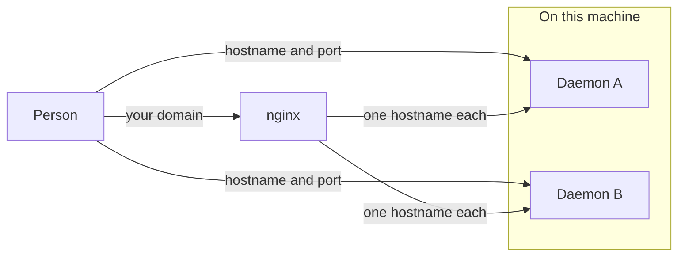
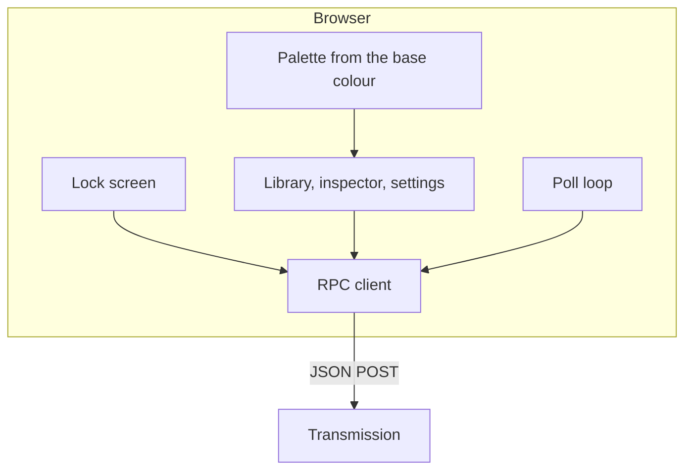
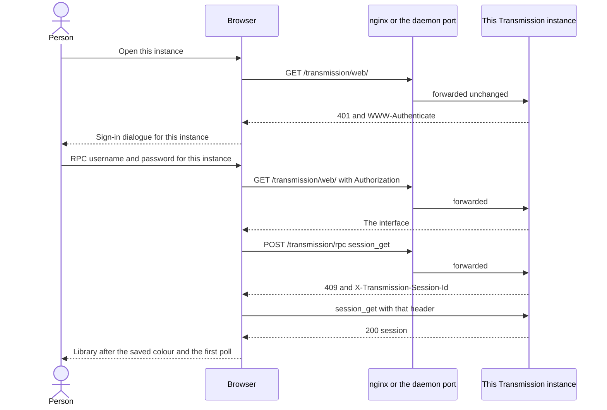
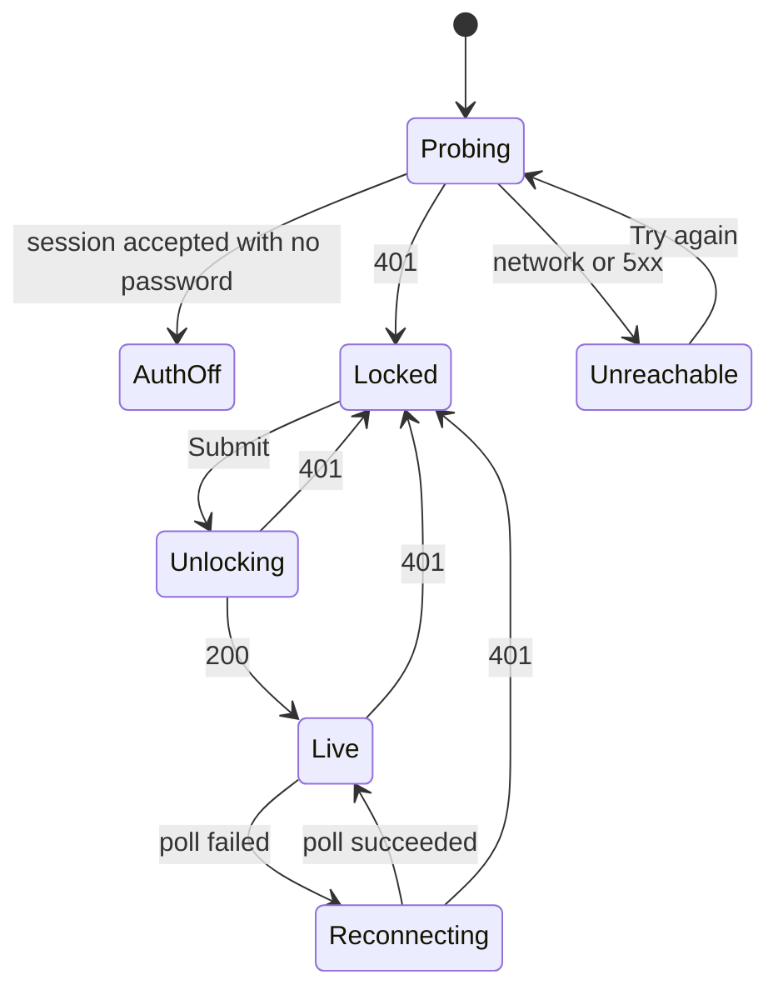
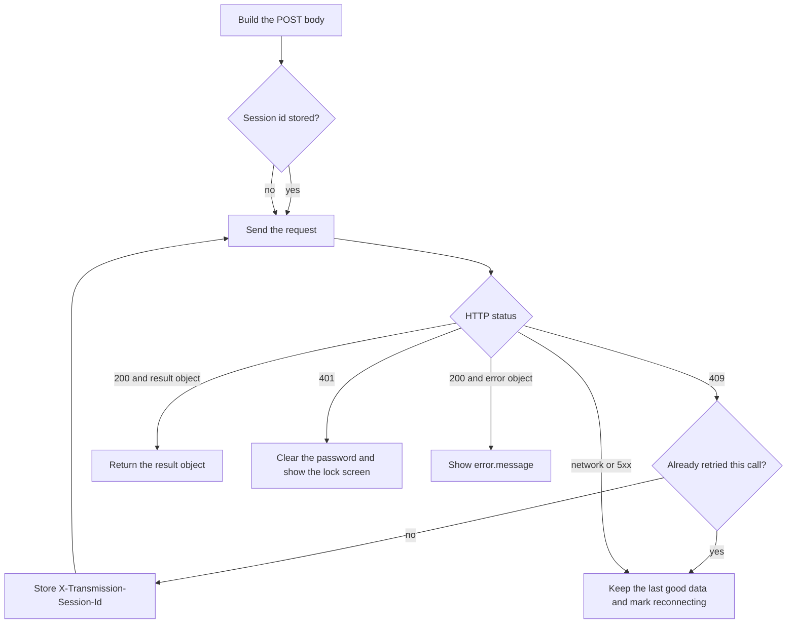
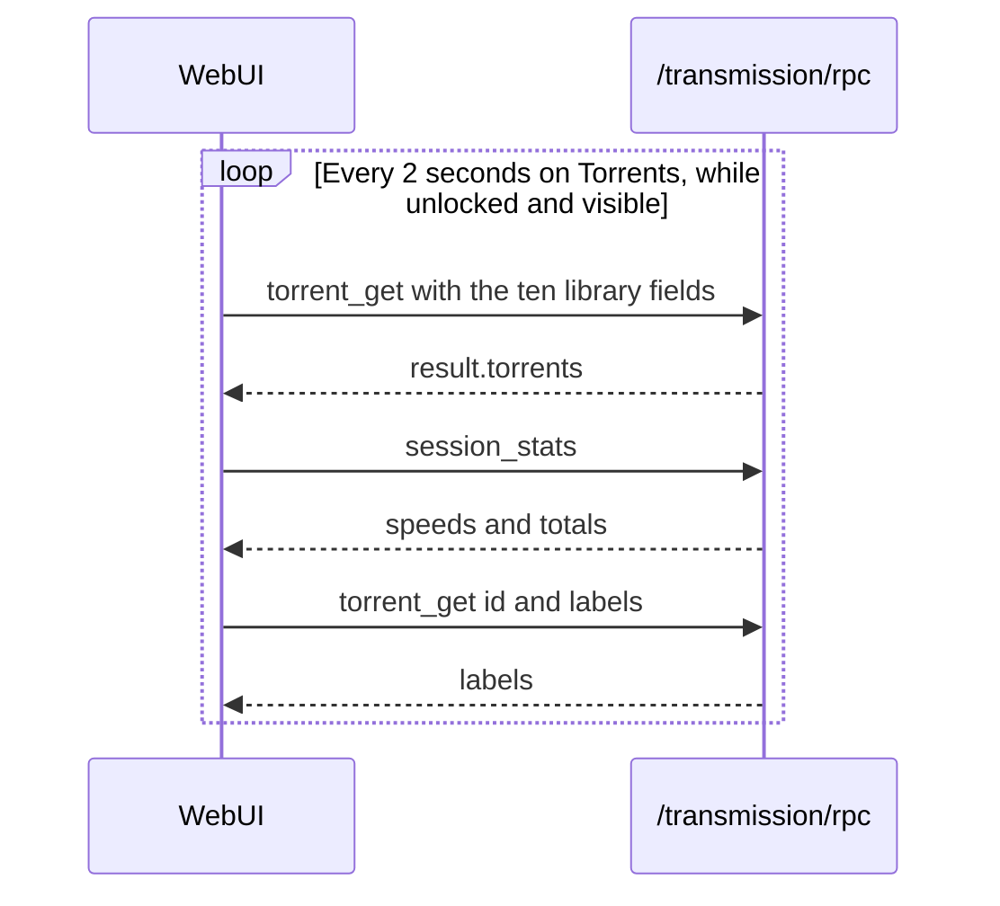

# Transmission WebUI

A browser interface for a Transmission daemon. Several daemons can run at once. Each one serves this same static page from its own `TRANSMISSION_WEB_HOME`. The page keeps no server of its own, and the only password is the one that daemon already requires. Remote access goes through nginx, which proxies to that daemon and does not host a second copy of the files.

This document describes the interface that ships in `Deployment/webui`. The pictures under `mockups/` are earlier static mockups of the default teal theme. They are not regenerated when the layout changes. Where a picture still shows a toolbar of torrent actions, a Back control, a Shut down button, or a piece map drawn in the accent hue, the text here is the page that ships.

Target daemon: Transmission 4.1 or newer. The current release this design is written against is 4.1.3. The wire protocol is JSON-RPC 2.0, as specified for that release in the [Transmission 4.1.3 RPC specification](https://github.com/transmission/transmission/blob/4.1.3/docs/rpc-spec.md). Methods and fields are snake_case (`torrent_get`, `percent_done`). The older bespoke protocol is deprecated and this interface does not speak it. On unlock, `session_get` must report `rpc_version_semver` of `6.0.0` or newer (Transmission 4.1.0). An older daemon gets a blocking message and no library.

## 1. What it has to do

- Sign-in uses Transmission’s RPC username and password. The interface stores no password of its own.
- Every call is an HTTP POST to `/transmission/rpc`.
- A `409` response yields a new `X-Transmission-Session-Id`. The client stores that value and sends the same request again with the header set.
- While the library is open, the client polls `torrent_get` every 2 seconds for `id`, `name`, `status`, `percent_done`, `rate_download`, `rate_upload`, `eta`, `total_size`, `upload_ratio`, and `error_string`.
- The same screen manages the session: add, start, stop, verify, reannounce, queue, files, peers, trackers, labels, speed limits, and the rest of the session settings Transmission exposes.
- The chrome is hues of one colour, including the favicon. A complete torrent’s progress is green, and the piece map uses grey, red, and green, as set out below. Colour and page title are stored in this browser for this origin. They are not copied to another device. Light, dark, or system stays on the device.
- Torrent status, speeds, and session facts are whatever Transmission last reported. A setting changes on screen only after the daemon accepts it and a follow-up read returns the new value.
- The shell is laid out with CSS flex and grid.
- The page is a full-screen PWA. The document does not scroll. Scrolling happens inside the list, the inspector, settings, and menus.
- The interface has its own semantic version, shown in the product and used as `?vX.Y.Z` on every static file.
- Displayed values are human-readable. An unknown estimate is shown as ∞.
- Right-click and long-press open the action menu. Several torrents can be selected and started, stopped, or removed together.
- The same information is usable with a mouse on a wide window and with a thumb on a phone.
- Interface copy uses British spelling. RPC field names stay as Transmission spells them.

## 2. Context



Each daemon serves the same interface from its own `TRANSMISSION_WEB_HOME`. Locally that is a hostname and the daemon’s port. Remotely it is a hostname on your own domain, with nginx in front. The page and `/transmission/rpc` for that daemon share an origin. Script can read `X-Transmission-Session-Id` on that origin. A page loaded from one instance never calls another instance’s RPC.



There is no application backend. Credentials, the session id, and the torrent list live in the page.

## 3. Hosting

The interface is always served by Transmission from `TRANSMISSION_WEB_HOME`. nginx does not keep a second copy of the HTML, CSS, or scripts. It reverse-proxies remote access to the daemon that owns that hostname.

Two directories in this project:

| Directory | Role |
|---|---|
| `Testing/webui-test` | The files the test daemon serves. Copy the interface here while testing. |
| `Deployment/webui` | The files to install. Copy this directory into each daemon’s `TRANSMISSION_WEB_HOME`. |

The test stack is `Testing/docker-compose.yml`. It runs the linuxserver Transmission image with `TRANSMISSION_WEB_HOME=/webui`, bind-mounts `./webui-test` at `/webui`, and publishes port 9091. Open it at `http://<hostname>:9091/transmission/web/`. The RPC password is the one in that compose file. This document does not repeat it.

Local access is `http://<hostname>:<port>/transmission/web/`. Remote access is `https://<name>.<your-domain>/transmission/web/` through nginx. Each instance is its own origin, so the HTTP password cache, the installed app, the colour, and the title stay separate. A shared hostname would mix them.

Transmission then serves:

| Path | What it is |
|---|---|
| `/transmission/web/` | This interface |
| `/transmission/rpc` | That daemon’s RPC |

The client calls the absolute path `/transmission/rpc`. From a page at `/transmission/web/`, that path is the same host.

### Interface version

The interface version is `1.0.1`. Settings shows it as “Interface 1.0.1”, and adds the daemon version when `session_get` has returned one. The same string is the cache-busting query on every static file: `app.css?v1.0.1`, `app.js?v1.0.1`, `manifest.webmanifest?v1.0.1`, icon URLs, and `sw.js?v1.0.1`. The HTML links use that query. Raising the version changes every URL, and the service worker drops the previous cache when it activates. The `v1.0.1` tag is this release. A cookieless probe that is redirected to a sign-in page is retried with the browser cookies.

`Deployment/webui` also contains an empty `default.json`. Leave that file in the web home. It is there so Transmission does not report a missing `default.json` when it starts.

### nginx

One server block per instance. The names below are placeholders. Use your LAN hostname and the names on your domain. Terminate TLS on nginx for remote access.

```nginx
server {
  listen 443 ssl;
  server_name media.example;

  client_max_body_size 16m;

  add_header Content-Security-Policy "default-src 'self'; connect-src 'self'; style-src 'self' 'unsafe-inline'; script-src 'self'; manifest-src 'self'; img-src 'self' data: blob:; worker-src 'self'; base-uri 'none'; form-action 'none'" always;

  location /transmission/ {
    proxy_pass http://127.0.0.1:9091;
    proxy_http_version 1.1;
    proxy_set_header Connection "";
    proxy_set_header Host $host;
    proxy_set_header Authorization $http_authorization;
    proxy_set_header X-Real-IP $remote_addr;
    proxy_set_header X-Forwarded-For $proxy_add_x_forwarded_for;
    proxy_set_header X-Forwarded-Proto $scheme;
    proxy_set_header X-Forwarded-Host $host;
    proxy_set_header X-Transmission-Session-Id $http_x_transmission_session_id;
    proxy_pass_header X-Transmission-Session-Id;
    proxy_pass_header X-Transmission-Rpc-Version;
  }
}
```

A second instance repeats the server with its own `server_name` and upstream port.

`proxy_pass` has no URI path of its own, so `/transmission/web/` and `/transmission/rpc` reach the daemon unchanged. The extra headers are there because Transmission checks them:

| Header | Why it is set |
|---|---|
| `Host` | `rpc_host_whitelist` compares this value. Transmission strips the port. |
| `Authorization` | Forwards the browser’s Basic credentials. nginx does not add a password and does not answer `401`. `WWW-Authenticate` is passed back. |
| `X-Transmission-Session-Id` | The browser sends the CSRF token on RPC. Without this line nginx drops it and every call stays on `409`. |
| `proxy_pass_header X-Transmission-Session-Id` | The `409` response carries the new token. It has to reach the browser. |
| `X-Transmission-Rpc-Version` | Present on `409` from Transmission 4.1 onwards. Passed back the same way. |
| `X-Real-IP`, `X-Forwarded-For`, `X-Forwarded-Proto`, `X-Forwarded-Host` | The daemon sees the browser’s address and scheme. |
| `Connection ""` with `proxy_http_version 1.1` | Drops the browser’s hop-by-hop `Connection` header. |

`client_max_body_size 16m` leaves room for a `.torrent` file sent as base64 `metainfo`. Raise it if a larger file is rejected.

`style-src` includes `'unsafe-inline'` so the page can place a menu against a row and set a progress fill. Scripts stay in files.

The `Host` value that reaches a daemon must be on that daemon’s `rpc_host_whitelist`. Localhost and IP addresses are already allowed, which covers opening the daemon port directly. Add each public hostname to the whitelist of the daemon it proxies to.

Local use is a hostname and port. In the test stack that is port 9091 on the daemon. Remote use is nginx on your domain.

The document head paints the default teal, and the title occupies a fixed-height placeholder, until the colour and title saved for this instance have been applied.

## 4. Signing in

Transmission checks the password. The page does not keep a second one, and it does not read `settings.json`.

The password Transmission expects is the plaintext configured as `rpc-password`, sent with the username from `rpc-username`. Transmission stores only a hash of that password. The page never sees the hash. Each daemon has its own username and password. Signing in to one instance does not sign in to another, because each hostname, and each hostname with its port, is its own origin.

Because the daemon serves the files, `rpc-authentication-required` applies to `/transmission/web/` as well as `/transmission/rpc`. The browser’s sign-in dialogue is the first gate, locally and through nginx. The document does not load until Transmission accepts the password. RPC calls use the browser’s cached credentials for that origin (`fetch` credentials stay `same-origin`). The page sends an explicit `Authorization` header when the person has just typed the password into the lock screen, so that typed password is the one checked.

On load, before any torrent data is drawn, the client probes `session_get` with `credentials: 'omit'`, so the browser does not attach the password it used to load the page. That is how the page tells a daemon that requires a password from one that does not.

| First probe, credentials omitted | What the page does |
|---|---|
| `401`, including after the `409` retry | Authentication is on. Keep the session id. Send `session_get` again with `credentials: 'same-origin'`. |
| Redirect (`301`–`308`, or an opaque redirect) | A gate in front of the daemon, such as nginx `auth_request`, refused the cookieless probe and sent the browser to a sign-in page. Treat it as `401` and repeat `session_get` with `credentials: 'same-origin'`, so the website session cookie is sent. Do not follow that redirect. |
| `200` with a `result` object | Authentication is off. Show a blocking explanation: turn on RPC authentication in Transmission, then reload. Do not draw the library. |
| Network error or HTTP 5xx | Show “Transmission did not respond” and a way to try the probe again. |

| Second probe, browser credentials included | What the page does |
|---|---|
| `200` with a `result` object | The browser’s password was accepted. Open the library. Do not show the lock screen. |
| `401` | Show the lock screen for this instance. |

The lock screen asks for the username and password of this instance. The username may be saved in `localStorage` under `twui.username` for this origin only. The password is held in memory for the tab and is cleared on lock, on `401`, and when the tab closes. It is never written to `localStorage`, `sessionStorage`, the URL, or a log.

A normal visit therefore asks once, in the browser dialogue, and then opens the library in this browser’s saved colour for this origin. There is no Lock control on the page. A later `401` clears the in-memory list and shows the lock screen. The next RPC call waits until that form is submitted with an explicit `Authorization` header.

Submitting the form calls `session_get` with `Authorization: Basic …`. The value is the base64 of the UTF-8 bytes of `username:password`, not the result of `btoa` on a JavaScript string that may contain characters outside Latin-1.

| Unlock result | What the page does |
|---|---|
| `200` and a `result` object | Open the library and start polling, after the version check below. |
| `401` | Stay on the lock screen. Clear the password field. Say that Transmission did not accept the password. |
| `409` | Store the new session id and retry this call once. |

A later `401` on any call, including a poll, clears the in-memory list and returns to the lock screen.

`session_get` on unlock reads `rpc_version_semver`. This interface requires `6.0.0` or newer, which is Transmission 4.1.0. An older value, or a body that is still the bespoke `{ "result": "success" }` shape, blocks the library and says this interface needs Transmission 4.1 or newer. Controls whose methods the daemon rejects are hidden after the first rejection.






## 5. The RPC client

Every call is:

```http
POST /transmission/rpc HTTP/1.1
Content-Type: application/json
X-Transmission-Session-Id: <stored id, omitted on the first call>
Authorization: Basic <credentials, omitted on the unauthenticated probe>
```

```json
{
  "jsonrpc": "2.0",
  "method": "torrent_get",
  "params": { "fields": ["id", "name"] },
  "id": 12
}
```

`id` is an integer the client chooses, increased for each call. A response with a different `id` is ignored. A body with no `id` is a notification and is ignored. HTTP is usually `200` for both success and RPC failure. `204` is a notification and is ignored.

A success body has a `result` object. That object is the method’s return value (`torrents`, session keys, and so on). An error body has `error.code`, `error.message`, and sometimes `error.data.error_string` and `error.data.result`. Show `error.message`, and `error.data.error_string` when it is present. There is no `result: "success"` string in this protocol.



Rules for the `409` path:

- Read `X-Transmission-Session-Id` from the response. If the header is missing, fail the call. Do not retry.
- From `rpc_version_semver` `6.0.0` the same response also carries `X-Transmission-Rpc-Version`. Record it when it is present.
- Replace the stored session id with the session-id header.
- Send the original method, params, and `id` once more, with the session header attached.
- A second `409` on that same call stops. Surface a connection error. Do not loop.
- Parallel calls that all receive `409` may each retry once. They share the latest stored id.

The client aborts a call that has not finished after 15 seconds so a stuck poll cannot pile up.

`ids` in a torrent method may be an integer, a list of ids or hashes, or the string `recently_active`. Omitting `ids` means every torrent. Integer ids are not stable across a daemon restart. The interface uses them for the life of the page. After a restart the next poll replaces the list.

## 6. Polling

The library poll starts as soon as unlock succeeds, then every 2 seconds. A tick is skipped when a previous tick is still in flight, when the document is hidden, or when the page is locked. Becoming visible again runs a tick immediately and then resumes the 2 second cadence. Switching back to Torrents from Activity or Settings also runs a tick immediately.

Each tick is numbered. A reply that belongs to an older tick is ignored, and that older tick does not clear the in-flight flag of the tick that replaced it. Stopping the poll advances the number, so a reply still on the wire cannot overwrite the library after the page has locked or moved on.

On the Torrents view, a tick does these calls, in order:

1. `torrent_get` with no `ids` (every torrent) and exactly these fields, in this order:

   `id`, `name`, `status`, `percent_done`, `rate_download`, `rate_upload`, `eta`, `total_size`, `upload_ratio`, `error_string`

2. `session_stats`, for the speeds and totals in the sidebar and on the activity page. `session_stats` is not added to the ten library fields.

3. When the view is still Torrents, a `torrent_get` of `id` and `labels` only.

4. When exactly one torrent is selected and the inspector is open (always on a wide window, and when the detail is open on a narrower window), a `torrent_get` for that id and the detail fields in section 9.

Activity and Settings do not request the torrent list or the labels. Those ticks call `session_stats` only. The field list on call 1 does not grow. Queue position, files, peers, and trackers stay on the detail call.

The list is built once at the end of the tick. An older tick does not paint the list on the way through.



Example library request:

```json
{
  "jsonrpc": "2.0",
  "method": "torrent_get",
  "params": {
    "fields": [
      "id",
      "name",
      "status",
      "percent_done",
      "rate_download",
      "rate_upload",
      "eta",
      "total_size",
      "upload_ratio",
      "error_string"
    ]
  },
  "id": 41
}
```

`percent_done` is a fraction from 0 to 1. Rates are bytes per second. `total_size` is bytes. `eta` is seconds, and any value below 0, including `-1`, means Transmission has no estimate. `error_string` is empty when there is no error. The numeric `error` field is 0 when fine, 1 for a tracker warning, 2 for a tracker error, and 3 for a local error. The library uses `error_string` for the Error filter.

`status` maps to a label:

| Value | Label | Library filter |
|---|---|---|
| 0 | Stopped | Stopped |
| 1 | Queued to verify | Checking |
| 2 | Verifying | Checking |
| 3 | Queued to download | Downloading |
| 4 | Downloading | Downloading |
| 5 | Queued to seed | Seeding |
| 6 | Seeding | Seeding |

Other library filters, still using only the polled fields:

| Filter | Rule |
|---|---|
| All | Every torrent |
| Active | `rate_download > 0` or `rate_upload > 0` |
| Finished | `percent_done` is at least 1 |
| Error | `error_string` is not empty |

A torrent can sit in both Downloading and Error. Counts are independent. Search is a case-insensitive substring of `name`, applied in the page, with no extra RPC. The default sort is by name. Column headers sort by any polled field. Sort and the current filter are remembered in `localStorage`.

### How values are shown

The page keeps the raw numbers from RPC. Everything drawn on screen is formatted.

| Value | On screen |
|---|---|
| Sizes, speeds, memory | `units` from the unlock `session_get`: `speed_bytes`, `size_bytes`, `memory_bytes`, and `speed_units`, `size_units`, `memory_units`. A rate of 0 is a formatted zero, such as `0 kB/s`. |
| Before `units` has arrived | Divide by 1000 and use B, kB, MB, GB, TB. |
| `percent_done` beside a progress bar | Two decimal places, floored, so a fraction just under 1 cannot read as 100%. `100.00%` and a full bar only when the fraction is at least 1. |
| `recheck_progress`, peer progress | A whole-number percentage from the 0–1 fraction. |
| `upload_ratio` | Two decimal places. |
| `eta` and other durations | Hours and minutes, or seconds when the duration is under a minute. Any `eta` below 0 is ∞. |
| Unix timestamps | The local date and time. |
| Counts | Grouped digits. |

While the Torrents view is open, the labels call above runs on the same 2 second tick. It is not part of the ten library fields, and it does not run on Activity or Settings.

While exactly one torrent is open in the inspector, the detail call on the same tick asks for that id and the detail fields in section 9. A multi-selection does not fetch peers or files. The overview is not rebuilt from scratch on every tick: when the torrent, the tab, and the shape of that view are unchanged, the speeds, progress, and piece map are updated in place. The piece canvas is left as it is when `pieces` and `availability` are unchanged. A new torrent often has no piece count on the first read. When the piece count, name, or hash arrives, the overview is built again and the piece map is drawn.

A failed tick keeps the last list on screen and shows a reconnecting state. The next tick is still 2 seconds later. `401` leaves that path and locks.

## 7. The server is the record

Anything the page says about a torrent or the session comes from the latest successful RPC read. The page does not invent a status, a speed, a progress value, or an error, and it does not treat the button the person pressed as the new state.

A write (`torrent_start`, `torrent_stop`, `torrent_set`, `session_set`, and the other mutators) updates the screen only after both of these are true:

1. The write returns HTTP `200` and a `result` object.
2. A follow-up read of the affected fields returns, and the screen shows those returned values.

The follow-up read is `torrent_get` for torrent fields and `session_get` for session fields. Transmission may clamp or ignore a value, so the page displays what the read returns, which can differ from what was sent. Methods whose `result` carries no torrent fields, such as `torrent_start`, still need that read: a `result` object means the command was accepted, and the next `torrent_get` is what changes the status label.

Until that read arrives, the previous server values stay on screen. The control that was used is disabled, so the same change cannot be sent twice. The rest of the page stays usable, including changing which torrents are selected. The control does not move to the requested value early. If the write returns an `error` object, times out, or the follow-up read fails, the control is enabled again and the last accepted values remain. The error text is shown on that action.

Text fields may hold a draft while they are focused, so the person can type. The draft is not the setting. Save, or leaving the field, sends the write and disables the field until the follow-up read returns. The field then shows the server value. If the write fails, the field returns to the previous server value and is enabled again.

Toggles, selects, and checkboxes show the last read value the whole time. They move when the follow-up read says they moved. While one is disabled, another choice in that same control cannot be sent.

These values are always a read, never a local guess: `status`, `percent_done`, rates, `eta`, `upload_ratio`, `error_string`, peer and file progress, `session_stats`, free space, `port_is_open`, and `blocklist_size`.

Colour and the page title are the other case. They are not Transmission fields. They are stored in this browser for this origin (`twui.baseColor` and `twui.title`). Saving repaints this page, including the favicon and the window title. Another browser, and another device, keeps its own copy. The hostname shown in the sidebar is the real address of this instance, from `location.host`. The page title is a label the person sets so two instances are easy to tell apart. It is not a substitute for the host.

## 8. Library

Wide layout: filters and session speeds on the left, the torrent table on the right.


The same hue in dark mode. Stopped rows use a duller fill. Errors use a darker or lighter step of the same hue, plus the error text.


On a phone the table becomes cards, filters become a scrolling row of chips, and Torrents, Activity, and Settings sit on a bottom bar. Session speeds stay under the title.


Several torrents can be acted on together. On a wide window: click selects one row, shift-click selects a range, and command- or control-click toggles a row. Escape clears the selection. On a phone, a tap opens that torrent, unless select mode is on.

The toolbar is one row at every width: Filter by name, and Add. Start, Stop, Verify, Remove, More, Select, and Lock are not on the toolbar. The toolbar and the phone chip row are hidden when the view is not Torrents. The sidebar filters stay visible, and a filter is marked active only on the Torrents view. Torrent actions live on the inspector and on the popup menu.

Right-click on a wide window, and a long press on a phone, open the same popup menu. `user-select: none` and `-webkit-touch-callout: none` keep the long press from selecting text or showing the browser callout. If the pressed row is already in the selection, the menu applies to every selected id. Otherwise it applies to that row. The menu lists Start, Stop, Start now, Verify, Reannounce, Rename (one torrent), Set location, Move to top, Move up, Move down, Move to bottom, and Remove.

The menu also offers Select, except when select mode is already on and the pressed row is part of the selection, and except when the menu was opened from More on the inspector. Choosing Select enters select mode with that torrent, or keeps the current multi-selection when the menu applies to all of it. A banner at the bottom of the workspace shows how many torrents are selected, and an X that leaves select mode and clears the selection. In select mode a plain click toggles the row, on a wide window and on a phone. Checkboxes are shown while selecting. On a phone the selecting row is a two-column grid: the checkbox beside the card, and the progress bar on the next row at full width.

The library row puts the progress bar on its own full-width line under the name, with the percentage on the right. The header groups Name and Progress, then Size, Down, Up, ETA, and Ratio. The grid is `minmax(0, 1fr) 5.6rem 5.6rem 5.6rem 4.6rem 3.6rem`. The progress cell spans every column.

A torrent with `percent_done` of at least 1 is complete. Its row is tinted green and its bar is `#2e7d32`, ahead of the stopped and error colours. The percentage is green as well.

The inspector’s own actions are Start, Stop, Verify, Remove, and More, aligned to the start. Close is an X at every width. Closing clears the selection. There is no Back button. Below 1100px the list is hidden while the inspector is open, and the inspector fills the space above the bottom bar.

The workspace and the inspector are white (`#fff`) in light mode. In dark mode they use the theme background. The sticky header row follows the same rule.

Choosing an action disables that action until the follow-up `torrent_get` returns or the call fails. The rows keep the last reported status until that read.

Transmission has no separate pause method. Stop is `torrent_stop`, which is how a torrent is paused.

| Action | Method | `params` |
|---|---|---|
| Start | `torrent_start` | `ids` |
| Start now | `torrent_start_now` | `ids` |
| Stop | `torrent_stop` | `ids` |
| Verify | `torrent_verify` | `ids` |
| Reannounce | `torrent_reannounce` | `ids` |
| Queue | `queue_move_top`, `queue_move_up`, `queue_move_down`, `queue_move_bottom` | `ids` |

Remove asks first. The calm choice removes the torrents and leaves the files: `torrent_remove` with `delete_local_data: false`. The other choice deletes the downloaded files. That choice is a second confirmation that names the count, then `delete_local_data: true`.

Keyboard, when focus is not in a field: `/` focuses the filter, `a` opens Add, and Delete or Backspace starts the remove confirmation for the current selection.

Verifying rows say “Verifying” or “Queued to verify”. The library poll does not include `recheck_progress`, so the bar keeps showing `percent_done`. The open inspector requests `recheck_progress` and shows that fraction there.

## 9. Inspector, add, and files

One selected torrent opens an inspector. On a wide window it is a third column. On a narrower window it replaces the list. Close is the X described in section 8. There is no Back button.


Tabs: Overview, Files, Peers, Trackers. They are loaded together for that one id:

`id`, `name`, `status`, `error`, `error_string`, `percent_done`, `percent_complete`, `recheck_progress`, `rate_download`, `rate_upload`, `eta`, `upload_ratio`, `total_size`, `size_when_done`, `have_valid`, `have_unchecked`, `downloaded_ever`, `uploaded_ever`, `left_until_done`, `download_dir`, `hash_string`, `is_private`, `comment`, `labels`, `queue_position`, `peers_connected`, `magnet_link`, `bandwidth_priority`, `honors_session_limits`, `download_limit`, `download_limited`, `upload_limit`, `upload_limited`, `seed_ratio_mode`, `seed_ratio_limit`, `seed_idle_mode`, `seed_idle_limit`, `peer_limit`, `group`, `sequential_download`, `sequential_download_from_piece`, `files`, `file_stats`, `wanted`, `priorities`, `peers`, `peers_from`, `trackers`, `tracker_stats`, `tracker_list`, `pieces`, `availability`, `piece_count`, `piece_size`.

`error` is 0 when fine, 1 for a tracker warning, 2 for a tracker error, and 3 for a local error. The visible text is `error_string`. On Transmission 4.1 and newer, `wanted` is a boolean array. If the daemon rejects `sequential_download`, that field is dropped and the ordered-download control is hidden.

Overview shows the speeds, estimate, ratio, and these sizes:

| Label | Field |
|---|---|
| Size | `size_when_done` |
| Have | `have_valid` plus `have_unchecked`, with no extra “not yet checked” note |
| Remaining | `left_until_done` |
| Downloaded | `downloaded_ever` |
| Uploaded | `uploaded_ever` |

The progress bar uses `percent_done` only. The same overview also shows location, hash, privacy, peer count, and queue position. Labels are edited in the controls below the stats.

The piece map is a canvas, one cell for every piece, including piece counts well above 2000. The canvas is filled white, and a 1px gap is left white between cells. The key under the map is:

| Colour | Meaning |
|---|---|
| `#9a9a9a` | Not downloaded |
| `#d32f2f` | Not available (`availability` is 0) |
| `#00c853` | Downloaded (the piece bit is set, or `availability` is −1) |

There is no Downloading entry in that key. A cell can still be drawn blue (`#1976d2`) when the torrent is downloading in order and that piece is the next incomplete piece from `sequential_download_from_piece`, or when a wanted file has exactly one incomplete piece. The RPC does not name the piece currently in flight, so a run of blue from the first gap is not drawn. Cells are 10px below 720px and 7px from there up. The key swatches are 16px and 11px at those same widths. Unused space at the end of the last row stays white.

Per-torrent controls write through `torrent_set`:

- Bandwidth priority: low `-1`, normal `0`, high `1`.
- Honour session speed limits: `honors_session_limits`.
- Download and upload caps: `download_limited`, `download_limit`, `upload_limited`, `upload_limit`. Limits are in kB/s, as Transmission defines them.
- Seed ratio and idle time: mode `0` follows the session, `1` uses this torrent’s limit, `2` is unlimited.
- Labels, peer limit, bandwidth group, and `sequential_download`.

Files lists `files` in order. A checkbox writes `files_wanted` or `files_unwanted` with the file’s index. Priority writes `priority_high`, `priority_normal`, or `priority_low`. An empty array means every file, so the client sends explicit indices.

Peers lists the `peers` array in a grid: address, client, progress, down, and up. On a phone the numeric columns stay visible. An empty list says no peers are connected. `peers_from` is a short breakdown: tracker, incoming, cache, DHT, PEX, LPD, and LTEP.

Trackers edits `tracker_list`: one announce URL per line, and a blank line between tiers. Saving calls `torrent_set`. The deprecated tracker add, remove, and replace arguments are not used.

Rename, for a single torrent, calls `torrent_rename_path` with `ids`, `path`, and `name`, then refreshes `files` and `name`.

Set location calls `torrent_set_location` with `location` and `move: true` to move the files, or `move: false` to look for them in the new directory.

Several selected torrents show a short summary from the library fields (count, size, combined rates) and the bulk actions. They do not load peers or files.

### Adding


The dialogue accepts a `.torrent` file or a magnet link or HTTP URL.

- A file is read in the browser and sent as base64 in `metainfo`.
- A magnet or URL is sent as `filename`.
- `download_dir` defaults to the session’s `download_dir`. Changing it calls `free_space` with `path` and shows `size_bytes` (and `total_size` when it is returned).
- “Start immediately” maps to `paused`, inverted. The initial checkbox follows `start_added_torrents`.
- Labels are sent on `torrent_add`.

Either `filename` or `metainfo` is required. A duplicate comes back as `result.torrent_duplicate` with no `error` object. The page says the torrent is already present and selects it.

## 10. Activity and session settings

Activity reads `session_stats`: `download_speed`, `upload_speed`, `active_torrent_count`, `paused_torrent_count`, `torrent_count`, plus `current_stats` and `cumulative_stats` (`downloaded_bytes`, `uploaded_bytes`, `files_added`, `seconds_active`, `session_count`). Those numbers are already refreshed by the 2 second tick. The wide layout also shows the current speeds at the bottom of the sidebar on every section. Speeds and byte totals are formatted with `units`, as in section 6.

Settings reads `session_get` when the section opens and again after each successful `session_set`. It does not poll the whole session every 2 seconds. Each control shows the value from that read. Changing a control sends `session_set`, disables that control, then `session_get` for the keys that were written, and the control updates from that second read, as in section 7.

| Section | What it edits |
|---|---|
| Appearance | This instance’s base colour and page title. Light, dark, or system, stored on this browser only. None of these are Transmission fields. The interface version is shown here. |
| Speed | `speed_limit_down`, `speed_limit_down_enabled`, `speed_limit_up`, `speed_limit_up_enabled`, `alt_speed_down`, `alt_speed_up`, `alt_speed_enabled`, `alt_speed_time_enabled`, `alt_speed_time_begin`, `alt_speed_time_end`, `alt_speed_time_day` |
| Downloads | `download_dir`, `incomplete_dir`, `incomplete_dir_enabled`, `start_added_torrents`, `rename_partial_files`, `trash_original_torrent_files` |
| Seeding | `seed_ratio_limited`, `seed_ratio_limit`, `idle_seeding_limit_enabled`, `idle_seeding_limit` |
| Connections | `peer_port`, `peer_port_random_on_start`, `port_forwarding_enabled`, `encryption`, `peer_limit_global`, `peer_limit_per_torrent`, `dht_enabled`, `pex_enabled`, `lpd_enabled`, `preferred_transports` |
| Queue | `download_queue_enabled`, `download_queue_size`, `seed_queue_enabled`, `seed_queue_size`, `queue_stalled_enabled`, `queue_stalled_minutes` |
| Blocklist | `blocklist_enabled`, `blocklist_url`, and `blocklist_update`, which returns `blocklist_size` |
| Groups | `group_get` and `group_set` when those methods succeed |

`encryption` is `required`, `preferred`, or `allowed`. Speed limits are integers, in kB/s, as Transmission 4.1.1 defines them. `preferred_transports` replaces the deprecated `tcp_enabled` and `utp_enabled` keys. Port check calls `port_test` with `ip_protocol` of `ipv4` or `ipv6` and reports `port_is_open`. Download directories show free space from `free_space`, which takes `path` and returns `size_bytes`. The deprecated `download_dir_free_space` field is not used.

Script paths (`script_torrent_done_filename`, `script_torrent_added_filename`, and `script_torrent_done_seeding_filename`, each with its `enabled` flag) live at the bottom of Downloads, as path fields, because they are session settings.

The page does not offer `session_close`. Transmission is left running.

The page does not offer a way to change the RPC password. That value is not a `session_set` field.

Wire keys are the JSON-RPC 2.0 snake_case names. Copy them as written.

## 11. Layout

The page is a full-screen app. `html` and `body` are `height: 100dvh` and `overflow: hidden`. The app grid fills that box. Scrolling happens inside the library list, the inspector body, settings, the filter list, menus, and a long truncation popup. Those regions use `overscroll-behavior: contain`. The document itself does not scroll.

Structure is CSS flex and grid. Floats are not used. `position` is not used to place columns, toolbars, or cards. The modal scrim is the exception: it is `position: fixed` and covers the viewport, and its contents are centred with grid (`place-items: center`). Menus and truncation popups are also positioned against the pressed row, inside the app.

| Width | Structure |
|---|---|
| 1100px and up | A grid of sidebar, list, and inspector. The inspector column is there when one torrent is selected: `240px minmax(0, 1fr) 380px`. Otherwise `240px minmax(0, 1fr)`. |
| 720px to 1099px | One column in a vertical flex. Filter chips are a horizontal flex row. The inspector is a drawer that fills the viewport, itself a vertical flex. |
| Under 720px | One column flex. Bottom bar: a grid of three equal tracks, Torrents, Activity, and Settings. The inspector replaces the list. |

Regions:

- The sidebar is a column flex: brand, the instance host (`location.host`), section links, a scrolling filter group (`minmax(0, 1fr)`), then speeds.
- The toolbar is a single row flex that does not wrap: the filter field grows (`flex: 1`), and Add sits at the end. It is hidden when the view is not Torrents.
- Each library row is a grid with the same column template as the header: `minmax(0, 1fr) 5.6rem 5.6rem 5.6rem 4.6rem 3.6rem`. Name and Progress share the first track in the header. The progress bar is its own row and spans every column, with the percentage at the end of that row. Name takes the remaining space (`minmax(0, 1fr)`).
- Phone cards use the same progress row. Below 1100px the Down and Up speeds in the phone header are aligned to the end of the header. The bottom bar does not scroll away with the cards.
- The inspector is a column flex: title, actions, tab list, then a scrolling body. Overview stats are a two-column grid. Tabs are a grid of equal tracks.
- Settings is the same shell grid. Each settings form is a column flex of labelled controls. A row of related controls is a wrapping flex.
- Dialogue actions are a row flex, aligned to the end.
- Every grid and flex child that holds text sets `min-width: 0`. Names, hashes, paths, errors, and tracker URLs use `overflow: hidden`, `text-overflow: ellipsis`, and `white-space: nowrap`, so a long string does not grow the row. Hover on a fine pointer, or a tap on a coarse pointer, opens a popup with the full string. The popup scrolls inside itself when the string is very long. Escape, or a tap outside, closes it. The cell stays the same size.
- Numeric columns use `font-variant-numeric: tabular-nums` and a reserved width, so `0 kB/s` and a larger speed occupy the same track.

Before the first successful library read, the list shows skeleton rows on the same grid as real rows, and the sidebar speeds and the title use fixed-height placeholders. The busy region sets `aria-busy="true"`. Placeholders are removed when that read arrives. An empty library is shown only after a read that returned no torrents. A value already on screen is not replaced with a placeholder.

Touch targets that are tapped are at least 44px on the short side. Rows on a wide window can be shorter. Hover-only actions are also available from a visible button or the popup menu. Inputs use a 16px font. The bottom bar respects the safe area.

The viewport is `width=device-width, initial-scale=1, maximum-scale=1, user-scalable=no`, and the root uses `touch-action: manipulation`, so the page does not pinch-zoom or double-tap zoom. Displayed text uses `user-select: none` and `-webkit-user-select: none`. Fields that are typed into keep a caret, so a password or a path can still be entered. This is a deliberate limit: the page cannot be zoomed, and torrent names cannot be selected. Targets stay at least 44px so the phone layout remains usable at the browser’s own scale.

The reconnecting banner sits above the list and does not cover the last row. Empty library: “No torrents yet” and the Add action. Empty filter: “Nothing in this filter” and a way back to All.

## 12. Colour and title

Several Transmission daemons can be open at once. Each one is its own origin. Colour and the page title help tell those instances apart on this browser: the window title, the page, the favicon, the browser chrome, and the installed icon. They are stored in `localStorage` for this origin only (`twui.baseColor`, `twui.title`). They are not sent to the daemon and they are not copied to another browser or another device. The host name under the brand is the real address, from `location.host`, so the instance is still identifiable if two colours or two titles are close.

The person picks the colour and the title in Settings on that instance. Backgrounds, text, borders, the accent, the ordinary progress bar, emphasis, and the favicon all use the colour’s hue. Lightness and chroma change. The hue does not. The piece map and a complete torrent’s green bar are the exceptions in sections 8 and 9. Changing the colour does not change any other origin. `document.title` and the in-app heading use the title. A successful save repaints this page at once. The next open of this address in this browser reads the same stored values before the first paint.

Preset swatches are `#14756F`, `#1F4E79`, `#5C4B8A`, `#8C3A3A`, and `#3D6B4F`. They are the only place a second hue appears, and only as a choice. A grey pick, OKLCH chroma below `0.02`, is rejected and the previous colour stays. Choosing a preset repaints this page once the save succeeds. The settings text says: “This colour marks this Transmission instance. Lightness is adjusted so text stays readable. The title is the name in the window. Both are remembered in this browser and applied the next time this address is opened.”


Default base colour: `#14756F`.

Colour and title are stored for this origin in this browser. With nothing saved yet, the colour is `#14756F` and the title is `Transmission`. The page that saved them is repainted at once. Another window of this browser reads the stored values the next time it opens or refreshes this address. Another browser, and another device, does not.

The colour control and the title field stay disabled until the change has been stored. Success applies the saved colour, favicon, and title on this page. Failure leaves the previous values and enables the controls.

Light, dark, and system stay on the device, in `localStorage` under `twui.appearance` (`light`, `dark`, or `system`). `system` follows `prefers-color-scheme`. The head script applies the default teal before the first paint, then replaces the tokens when the saved colour arrives. The title slot is a fixed height the whole time, so the header does not jump.

A second daemon starts from the default until a colour and title are saved there.

How a pick becomes a palette:

1. Convert the pick to OKLCH. Keep its hue `H`.
2. If chroma is below `0.02`, the pick is grey. Keep the previous colour. A grey has no hue to build from.
3. Build the light or dark set below from `H` and a small chroma taken from the pick. Do not use the pick’s lightness as a background. A near-white or near-black pick would otherwise wipe the page out.
4. The accent starts from the pick. Move its lightness, never its hue, until the accent and its label contrast at 4.5:1 or better, and until body text on the background does the same. Reduce chroma only when the colour would fall outside sRGB.
5. Emphasis, used for errors and destructive confirmation, is a further step of lightness on the same hue. Pair it with the error string or an icon. Library status uses words and this hue. The piece map in section 9 uses its own grey, red, and green.

Light surfaces, hue `H`:

| Token | Use | OKLCH lightness | Chroma |
|---|---|---|---|
| Background | Page | 0.97 | at most 0.02 |
| Surface | Sidebar, cards, dialogues | 0.995 | at most 0.012 |
| Sunken | Tracks, input fills | 0.94 | at most 0.025 |
| Text | Primary text | 0.27 | at most 0.04 |
| Muted | Secondary text | 0.45 | at most 0.03 |
| Border | Hairlines | 0.86 | at most 0.02 |
| Accent | Buttons, links, active progress, selection wash | adjusted from the pick | at most 0.12 |
| Emphasis | Error text and error progress | darker than the accent | same hue |

Dark surfaces invert the lightness and keep `H`: background near 0.21, surface near 0.26, text near 0.96, accent lightness raised so it reads on the dark surface, emphasis lighter than the accent.

Progress fill:

| Row | Fill |
|---|---|
| Downloading, queued to download, seeding, queued to seed | Accent |
| Verifying, queued to verify | Accent, with the status words carrying the meaning |
| Stopped | Muted step of the same hue |
| `error_string` not empty | Emphasis |
| Complete (`percent_done` at least 1) | `#2e7d32`, ahead of the stopped and error fills |

Selection is a soft wash of the accent, with the accent used for the current nav item.

The settings sentence next to the control matches the text in the paragraph above.

`prefers-reduced-motion` disables decorative motion. Verifying does not depend on an animated stripe.

### Favicon

The favicon is the same mark as the sidebar: a rounded square in the accent, and a downward arrow in the on-accent colour. It is an SVG document the page builds from the current palette and assigns to `<link rel="icon" type="image/svg+xml">`.

The first paint uses the default teal. When the saved colour arrives, and again when a colour save succeeds or light and dark changes, the page rebuilds the SVG and replaces the link. `<meta name="theme-color">` is set to the same accent at the same time, which colours the browser chrome and the installed app’s title bar.

`prefers-color-scheme` is the CSS media feature used when appearance is `system`. The name is the platform spelling and stays as written.

## 13. Installable app

The page meets the install criteria for a standalone web app: HTTPS (or localhost), a web app manifest, and a service worker with a `fetch` handler.

`manifest.webmanifest` includes:

| Field | Value |
|---|---|
| `name` | The instance title, plus this instance’s host |
| `short_name` | The instance title, so two installed apps are not both called Transmission |
| `id` | The origin, so each instance installs separately |
| `start_url` | `/transmission/web/` |
| `scope` | `/transmission/web/` |
| `display` | `standalone` |
| `background_color` | The current background token |
| `theme_color` | The current accent |
| `icons` | PNG at 192 and 512, plus a maskable 512. The mark and colours match the favicon. |

The manifest, icons, and service worker live in `TRANSMISSION_WEB_HOME` and are requested under `/transmission/web/`, each URL carrying `?v` plus the interface version from section 3. The shipped manifest uses the default teal so the app can be installed on the first visit. After the saved colour and title have been applied, the page draws the 192 and 512 icons on a canvas from that palette. The manifest `name` and `short_name` include the title. Another instance installs as a separate app with its own icon and title. The live favicon and `theme-color` follow a successful colour save on this page. Another browser does not take that colour until it is chosen there.

The service worker is registered at `/transmission/web/sw.js?vX.Y.Z`, so its scope is `/transmission/web/`. It caches the app shell, including the version query, so a repeat visit can open the shell. It does not cache `/transmission/rpc`. RPC is outside the worker’s scope, so those requests always go to the daemon that served the page, directly or through nginx. A cached shell with no network shows the unreachable state from section 4, and it does not replay old torrent lists as if they were current. Activating a worker for a new version deletes caches from the previous `?v` query.

## 14. When things fail

| Situation | Behaviour |
|---|---|
| Poll fails, password still good | Keep the last list. Show reconnecting. Retry on the next tick. |
| `401` | Lock, clear the list from memory, clear the password. |
| `409` twice on one call | Reconnecting, with the last list kept. |
| HTTP `200` with an `error` object | Show `error.message` on the action that caused it, plus `error.data.error_string` when it is present. Leave the last accepted values in place and enable the control again. |
| Add finds a duplicate | Say it is already there and select that torrent. |
| A method is unknown | Hide the control that called it. |
| Tab in the background | Do not poll. Poll once when it is visible again. |

## 15. Accessibility

- Landmarks: navigation for the sidebar or bottom bar, a main region for the list, and a complementary region for the inspector.
- The filter field, icon buttons, tabs, and the popup menu have visible names or accessible names.
- Focus is a 2px outline in the accent, visible on keyboard focus.
- Text on the background, and the accent label on the accent, meet 4.5:1. The progress track meets 3:1 against the surface.
- Colour is not the only status channel. Every state has words.
- Dialogues trap focus and return it to the control that opened them. Escape closes a dialogue before it clears a selection.
- Removing files is not the default button in the remove dialogue.
- Skeleton regions expose `aria-busy` until the first successful read.
- The page sets `user-scalable=no` and `user-select: none` on displayed text, as specified in section 11. Typed fields keep a caret. Touch targets stay at least 44px because the page cannot be zoomed.

## 16. Acceptance

The interface is ready when all of the following hold.

1. With RPC authentication enabled, a wrong password stays on the lock screen and a right password opens the library. With authentication disabled, the library stays hidden and the page says to turn authentication on.
2. The password is absent from `localStorage`, `sessionStorage`, and the URL after unlock, after lock, and after a reload.
3. The first RPC call of a fresh page receives `409`, stores `X-Transmission-Session-Id`, and retries once with that header. A second `409` on the same call does not retry again. Through nginx, that header is forwarded on the request and returned on the `409`.
4. A captured library request is JSON-RPC 2.0: `jsonrpc`, `method` `torrent_get`, `params.fields` exactly `id`, `name`, `status`, `percent_done`, `rate_download`, `rate_upload`, `eta`, `total_size`, `upload_ratio`, `error_string`, and an `id`. The next one starts about 2 seconds later while the tab is visible. A daemon whose `rpc_version_semver` is below `6.0.0` never shows the library.
5. Hiding the tab stops the poll. Showing it polls immediately.
6. A `401` during a poll returns to the lock screen and drops the torrent list from the page.
7. Add by file and add by magnet both call `torrent_add`. Remove, remove-and-delete, start, stop, verify, and queue move call the methods in the tables above. Stop is the pause action. Selecting several torrents sends one call with those `ids`.
8. Changing the base colour or the page title repaints this page, including the favicon and `document.title`, once the change is stored. Another window of this browser shows that colour and title after it is opened or refreshed. Another browser, and another device, keep their own. `theme-color` matches the accent. The sidebar shows `location.host`. Light and dark stay on the browser that set them.
9. At 390px width the library, a torrent, add, and settings are each usable without a horizontal page scroll and without the document scrolling. At 1440px the list and the inspector are on screen together. Those layouts are flex and grid. Lists scroll inside the app. The toolbar is Filter by name and Add on one row. The inspector closes with an X and has no Back control. There is no Shut down control.
10. Status text is present for downloading, seeding, stopped, verifying, and errors. A complete torrent is green, as in section 8. The piece map uses the colours in section 9, and its key does not list Downloading. Every status string is a label for the latest `status` or `error_string` from `torrent_get`. An unknown `eta` is ∞. The percentage beside a progress bar shows two decimal places and is not 100% until `percent_done` is at least 1. Speeds, sizes, ratios, and dates are human-readable. Finished uses that same complete test.
11. After `session_set` or `torrent_set` fails, the control still shows the previous server value and is enabled again. After it succeeds, the control shows the value from the follow-up `session_get` or `torrent_get`, including when that differs from the value that was sent. While the write is in flight, that control ignores further input.
12. Choosing Start leaves the status label unchanged until a later `torrent_get` reports a new `status`. The Start control stays disabled until then.
13. The browser offers to install the page served from `/transmission/web/`. Two hostnames install as two apps, named from each instance’s title. The service worker’s scope is `/transmission/web/`, so it does not answer `/transmission/rpc`. Static asset URLs end in `?v` plus the interface version, and Settings shows that same version.
14. Opening the interface locally uses a hostname and port. Opening it remotely uses nginx on your domain, which proxies `/transmission/` to that same daemon, forwards the password challenge, and forwards the session-id header both ways. The test copy is `Testing/webui-test`, served by `Testing/docker-compose.yml` on port 9091. The deployment copy is `Deployment/webui`.
15. The first library paint uses placeholders the same size as the finished rows, speeds, and title. Long names ellipsize, and a hover or tap shows the full string. Displayed text cannot be selected, and the page cannot be zoomed. Right-click and long-press open the action menu for the selection, or for that row when it is not selected.

The mockups in this folder are static HTML under `mockups/src/`, rendered to the PNG files beside them. They show the default teal and sample torrents, not a live daemon. They are earlier pictures and are not regenerated to follow later layout changes. The text in this document is the interface that ships.
